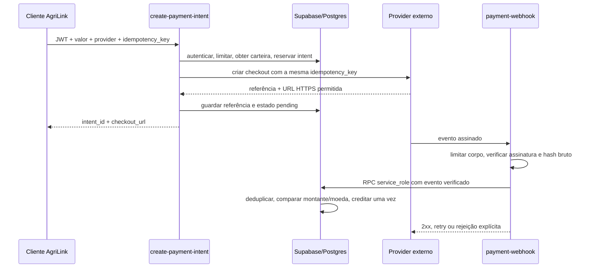

# Pagamentos e carteira AgriLink

## Estado atual

A carteira mantém saldos internos em `public.wallets`; lançamentos ficam em
`public.transactions`. O checkout externo é uma forma de carregar essa carteira,
mas o dinheiro só é creditado após um webhook validado pelo provider e aplicado
pela função SQL transacional.

Não existe adapter PSP activo nesta versão. A registry começa vazia, pelo que
`create-payment-intent` e `payment-webhook` recusam providers não configurados.
Não adicionar credenciais ou um nome de provider à UI para contornar essa
condição. A integração real exige documentação actual do PSP, sandbox, credenciais
separadas por ambiente e configuração do webhook no painel do PSP.

### Estado remoto em 2026-09-28

`create-payment-intent` e `payment-webhook` foram publicados no projecto AgriLink.
O checkout está com validação JWT activa; o webhook está sem JWT por desenho e
responde apenas a providers registados, cuja assinatura é validada pelo adapter.
Smoke tests sem credenciais confirmaram `401` para checkout anónimo e `503` para
provider não configurado. Não há adapter registado, portanto nenhum pagamento
pode ser iniciado ou creditado neste momento.

A migration `20260927090000_psp_wallet_foundation.sql` foi executada no remoto
como ficheiro SQL único e registada como aplicada. A validação confirmou as três
tabelas e RPCs, além de grants somente SELECT para `authenticated` nas tabelas
financeiras; `PUBLIC` e `anon` não têm grants. Uma auditoria detectou privilégios
residuais `TRUNCATE`, `TRIGGER` e `REFERENCES` herdados no ledger; uma revogação
adicional foi aplicada e confirmada remotamente.

O `supabase db push --linked --dry-run` geral continua a falhar com
`DbPushMissingLocalError`: o histórico remoto tem dezenas de versões sem ficheiros
correspondentes em `supabase/migrations`. Não executar `migration repair` em lote
nem `db push --include-all`: isso pode marcar versões sem validar o schema ou
tentar reaplicar migrations antigas. Reconciliar esse histórico numa tarefa
separada antes de futuros pushes normais.

## Componentes

- `provider.ts`: contrato e registry dos adapters, validação de eventos e URLs.
- `registry.ts`: único ponto de registo dos adapters habilitados; vazio por
  defeito.
- `crypto.ts`: primitivas Web Crypto para HMAC-SHA256 e SHA-256. Não guarda nem
  cifra dados de cartão ou credenciais.
- `webhookHandler.ts`: limita o corpo, verifica o provider antes de tocar no banco,
  calcula o hash dos bytes originais e traduz resultados em respostas HTTP/retry.
- `create-payment-intent`: endpoint autenticado para criar ou retomar uma intenção
  idempotente e pedir o checkout ao adapter.
- `payment-webhook`: endpoint público para callbacks server-to-server. JWT está
  desactivado intencionalmente; a autenticação é a assinatura validada pelo
  adapter específico.
- `20260927090000_psp_wallet_foundation.sql`: permissões do ledger, intents,
  eventos auditáveis, rate limit e liquidação idempotente.

## Contrato de adapter

Cada adapter implementa `PaymentProviderAdapter`:

- `id`: identificador estável em minúsculas, sem segredo.
- `checkoutHosts`: hosts exactos permitidos para o URL de checkout. Não usar
  curingas nem aceitar hosts vindos do pedido do utilizador.
- `createCheckout`: recebe intent, montante decimal em string, moeda, URL de
  retorno configurado no servidor e chave idempotente. Deve enviar essa chave ao
  PSP sempre que o PSP suportar idempotência.
- `verifyWebhook`: lê os bytes originais, valida a assinatura no formato oficial
  do PSP, valida timestamp/expiração e extrai `eventId`, `eventType`, referência,
  estado, montante, moeda e `bodySha256` dos mesmos bytes. Não confiar em campos
  não assinados nem em parâmetros do URL para identificar o pagamento.

Adicionar o adapter à lista privada em `registry.ts` só depois de testar sandbox,
assinaturas inválidas, eventos repetidos, eventos fora de ordem e falhas/retries.
Se o PSP não oferecer uma chave idempotente de criação, implementar reconciliação
segura antes de o habilitar; não repetir cobranças às cegas.

## Fluxo e estados

1. `create-payment-intent` exige JWT válido, corpo JSON estrito, montante positivo
   com até duas casas decimais, moeda `AOA`, carteira existente e provider
   registado.
2. A chave idempotente é um UUID único por utilizador. Reutilizá-la com outro
   provider, carteira, montante ou moeda devolve conflito. Repetir o mesmo pedido
   volta ao adapter com a mesma chave para recuperar o mesmo checkout.
3. O URL de retorno vem de `PAYMENT_RETURN_URL`, nunca do browser. URLs de checkout
   têm de usar HTTPS e o host exacto tem de estar em `checkoutHosts`.
4. O webhook só chega à RPC depois de assinatura e hash serem validados. O banco
   deduplica por `(provider_id, provider_event_id)` e também detecta reutilização
   do mesmo ID com outro hash.
5. Montante/moeda diferentes da intent são rejeitados. Uma intent ainda não
   associada à referência externa fica retentável (`503`); falha temporária da
   persistência também devolve `503`. O PSP deve reenviar esses eventos.
6. Só `succeeded` confirmado pelo PSP cria o lançamento `deposit` e incrementa o
   saldo, na mesma transacção SQL. A chave única por `payment_intent_id` impede
   crédito duplicado.

Estados de intent: `created`, `pending`, `processing`, `succeeded`, `failed`,
`cancelled`, `expired`, `refunded`. Eles descrevem a cobrança externa e não devem
ser confundidos com `transaction_status` do ledger. Um sucesso confirmado pode
ser aceite após uma falha/cancelamento anterior, pois providers podem entregar
eventos fora de ordem; depois de sucesso, eventos posteriores não voltam a
creditar nem reverter o saldo. Reembolsos exigem fluxo contabilístico próprio e
não são inferidos por este webhook.

## Segurança e dados

- Clientes autenticados só podem ler a própria carteira, movimentos e intents.
  Escritas de carteiras/transacções e a RPC de liquidação estão reservadas ao
  `service_role`; nunca enviar essa chave ao frontend.
- `verify_jwt = false` no webhook não autentica callbacks. A assinatura e a
  verificação de timestamp são obrigatórias dentro de cada adapter, antes da RPC.
- O handler aceita no máximo 64 KiB de webhook; a criação de intent aceita no
  máximo 16 KiB. O rate limit por utilizador é atómico no Postgres e falha fechado
  se não estiver configurado.
- Não guardar PAN/CVV, segredos de assinatura, tokens de acesso, headers de
  autorização ou payload bruto. O log guarda apenas identificadores de evento,
  estado, código de erro e SHA-256 do corpo para auditoria/deduplicação.
- O transporte deve usar TLS. Supabase/Postgres fornece encriptação em repouso
  gerida pelo serviço; este módulo não implementa cifra própria de campos porque
  não armazena dados de cartão nem tokens PSP. Se no futuro forem necessários
  tokens de pagamento, definir gestão/rotação de chaves e cifra autenticada
  (AEAD/KMS) antes de os persistir.
- Configurar rate limiting/WAF na entrada de webhooks de acordo com os limites do
  PSP e monitorizar `401`, `409`, `422` e `503`. A assinatura evita liquidação
  forjada, mas não substitui protecção contra flood/DDoS.
- A carteira é saldo interno. Não chamar `blocked_balance` de escrow nem prometer
  custódia/liquidação ao vendedor sem suporte do PSP e validação legal/operacional.

## Configuração e deploy

1. A migration está aplicada no projecto ligado. Para novas migrations, corrigir
  primeiro o drift histórico; nunca executar `db push --include-all` sem rever o
  plano. Confirmar grants/RLS no ambiente antes de produção.
2. Antes de iniciar checkout, guardar no Supabase Edge Function secrets, nunca em `VITE_*`:
   `PAYMENT_RETURN_URL`, `PAYMENT_INTENT_RATE_LIMIT_MAX`,
   `PAYMENT_INTENT_RATE_WINDOW_SECONDS` e os segredos específicos do adapter.
   Os dois parâmetros de rate limit têm de ser inteiros positivos; o banco limita
   o máximo a 1000 pedidos e a janela a 86400 segundos. Escolher valores com base
   em limites e necessidades reais.
3. Configurar no PSP a URL
   `https://<project-ref>.supabase.co/functions/v1/payment-webhook/<provider-id>`
   e o segredo de assinatura correspondente ao ambiente.
4. Adicionar e testar o adapter, executar `supabase functions deploy
   create-payment-intent payment-webhook` e testar o ciclo completo em sandbox.
5. Só promover para produção depois de confirmar a primeira cobrança e o único
   crédito correspondente no ledger, incluindo retries do webhook e replay.

`SUPABASE_SERVICE_ROLE_KEY` é providenciada pelo runtime Supabase e permanece
exclusiva do servidor. Não imprimir segredos nos logs ou em respostas HTTP.

## Testes e limitações

Os testes em `src/features/payments` verificam contrato/registry, HMAC, digest,
URLs, assinatura inválida, divergência de hash, payload excessivo, retry,
duplicados e indisponibilidade de persistência. Os testes usam adapters locais
apenas como fixtures; não existem providers fictícios habilitados no runtime.

A migration foi executada e os privilégios foram verificados no Supabase remoto;
`db lint --linked` só reportou três avisos preexistentes em funções não relacionadas
com pagamentos. As Edge Functions foram publicadas e passaram pelo bundler do CLI,
mas precisam de testes de contrato com sandbox real do PSP. Sem documentação e
credenciais do provider não é possível provar essa compatibilidade. Até um adapter
ser adicionado, os endpoints ficam fechados e não criam pagamentos reais.